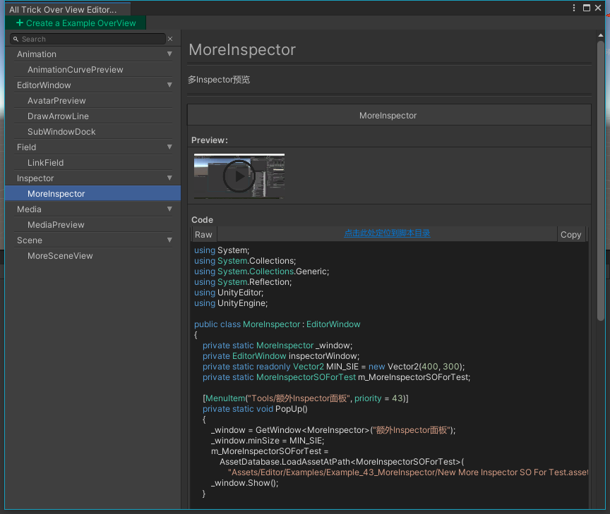

# UnityToolchainsTrick
提供一些UnityEditor工具链开发的常用小技巧与示例(Provides some common tips and examples for developing the UnityEditor toolchain)  
本项目由[JetBranins](https://www.jetbrains.com/?from=Unity3DTraining)赞助相关开发工具  

## 视频教程  
* [Unity编辑器开发常用小技巧(B站)](https://www.bilibili.com/video/BV1nh411U7iU)  

## 博客  
* [Unity编辑器拓展Wiki开源项目，装得下，世界都是你的-By 烟雨](https://zhuanlan.zhihu.com/p/364250160)  

## OverViewWindow
本项目提供了一个用于预览所有编辑器拓展样式的EditorWindow，可通过Tools-AllTrickOverView进行打开，使用教程参见[Unity编辑器拓展Wiki开源项目，装得下，世界都是你的-By 烟雨](https://zhuanlan.zhihu.com/p/364250160)

**注意，此插件基于Odin进行制作，所以需要项目中导入Odin插件，Odin官网：[https://odininspector.com/](https://odininspector.com/)**

如果不需要此预览插件，前往并删除 **Assets/Editor/AllTrickOverView** 目录即可

## 效果列表  
### [1.Clone一份UnityCsReference并时常回顾](https://github.com/Unity-Technologies/UnityCsReference)  
### [2.使用Odin Inspector插件](https://odininspector.com)  
### [3.EditorIcons](Assets/Editor/Examples/Example_03_EditorIcons)  
   
### [4.GUIStylesPreview](Assets/Editor/Examples/Example_04_GUIStyles)  
   
### [5.编辑下通过代码修改保存资产的方法](Assets/Editor/Examples/Example_05_SaveAssets)  
### [6.EditorWindow上画一条带有箭头的线](Assets/Editor/Examples/Example_06_DrawArrowLine)  
### [7.MissingPrefab查找](Assets/Editor/Examples/Example_07_MissingPrefabChecker)  
### [8.MissingComponent查找](Assets/Editor/Examples/Example_08_MissingComponentChecker)  
### [9.AvatarPreview实现](Assets/Editor/Examples/Example_09_AvatarPreview)  
### [10.TimeControl实现](Assets/Editor/Examples/Example_10_TimeControl)  
### [11.EditorWindow的showButton使用](Assets/Editor/Examples/Example_11_ShowButtonEditorWindow)  
### [12.Preference拓展实现](Assets/Editor/Examples/Example_12_Preference)  
### [13.Gizmos的用法](Assets/Editor/Examples/Example_13_GizmosExstension)  
### [14.编辑器下读取Excel表格共享的问题](Assets/Editor/Examples/Example_14_ExcelShareRead)  
### [15.EditorWindow代码停靠与合并](Assets/Editor/Examples/Example_15_SubWindowDock)  
### [16.创建多个SceneView等窗口](Assets/Editor/Examples/Example_16_MoreSceneView)  
### [17.EditorWindow层级管理](Assets/Editor/Examples/Example_17_MultiWindowLayerManagement)  
### [18.SceneView的拓展](Assets/Editor/Examples/Example_18_SceneViewExtension)  
### [19.特效快速预览](Assets/Editor/Examples/Example_19_ParticleSystemPreview)  
### [20.改变UnityEditor的标题栏](Assets/Editor/Examples/Example_20_TitleModifier)  
### [21.变体统计工具](Assets/Editor/Examples/Example_21_ShaderKit)  
### [22.Tools.current、Tools.viewTool](Assets/Editor/Examples/Example_22_ToolsAPI)  
### [23.Unity 侦听进入播放模式、Unity加载时初始化编辑器类](Assets/Editor/Examples/Example_23_EditorEventListener)  
### [24.Unity在Editor下获取键盘等Input事件](Assets/Editor/Examples/Example_24_GetInputEvent)  
### [25.Editor下监听全局按键事件](Assets/Editor/Examples/Example_25_GlobalInputEvent)  
### [26.预制体的修改与保存](Assets/Editor/Examples/Example_26_PrefabModify)  
### [27.EditorWindow右键弹出菜单](Assets/Editor/Examples/Example_27_EditorWindowContextClick)  
### [28.代码锁定场景物体不可点击选中](Assets/Editor/Examples/Example_28_SceneViewLock)  
### [29.获取动画曲线的预览](Assets/Editor/Examples/Example_29_AnimationCurvePreview)  
### [30.复合枚举实现UnityEditor中下多选下拉栏](Assets/Editor/Examples/Example_30_CompositeEnum)  
### [31.Transform拓展增加复制粘贴](Assets/Editor/Examples/Example_31_ExtendedTransformEditor)
### [32.AdvancedDropDown使用案例](Assets/Editor/Examples/Example_32_AdvancedDropDown)
### [33.ProjectWindowItemOnGUI使用:显示文件大小和后缀](Assets/Editor/Examples/Example_33_ProjectWindowItemOnGUI)
### [34.LinkField:可链接工程文件和URL](Assets/Editor/Examples/Example_34_LinkField)
### [35.SetObjectIcon:设置Object图标](Assets/Editor/Examples/Example_35_SetObjectIcon)
### [36.进入开发者模式](Assets/Editor/Examples/Example_36_DeveloperMode)
### [37.在EditorWindow中显示WebView](Assets/Editor/Examples/Example_37_WebViewEditorWindow)
### [38.在EditorWindow中播放VideoClip](Assets/Editor/Examples/Example_38_VideoEditorWindow)
### [39.SceneVisibility](Assets/Editor/Examples/Example_39_SceneVisibility)
### [40.使用NotKeyable避免动画误操作修改参数](Assets/Editor/Examples/Example_40_NotKeyable)
### [41.打开文件拓展](Assets/Editor/Examples/Example_41_OpenExtension)
### [42.BoundsHandle](Assets/Editor/Examples/Example_42_BoundsHandle)
### [43.MoreInspector](Assets/Editor/Examples/Example_43_MoreInspector)
### [44.ReplacementComponents](Assets/Editor/Examples/Example_44_ReplacementComponents)  
### [45.仿Odin的左侧树型菜单](Assets/Editor/Examples/Example_45_MenuEditorWindow)  
### [46.查找代码内的中文](Assets/Editor/Examples/Example_46_FindChinese)  
### [47.一行代码绘制普通对象的功能](Assets/Editor/Examples/Example_47_DrawNormalObject)  
### [48.自动处理九宫格工具](https://github.com/kyubuns/Auto9Slicer)  
### [49.利用友元访问内部api](Assets/Editor/Examples/Example_49_Friend)  
### [50.监听Unity编辑器聚焦/失焦](Assets/Editor/Examples/Example_50_UnityEditorFocus)
### [51.射线检测](Assets/Editor/Examples/Example_51_RaycastTargetChecker)
### [52.反射信息缓存](Assets/Editor/Examples/Example_52_Utility_TypeCache_Attribute)
### [53.自定义资产图标](Assets/Editor/Examples/Example_53_CustomAssetsIcon)  
### [54.Unity 引用查找工具-ReferenceFinder](https://github.com/blueberryzzz/ReferenceFinder)  
### [55.在EditorWindow上调用Inspector的绘制](/Assets/Editor/Examples/Example_55_DrawInspectorOnEditWinow)  
### [56.编辑器协程与动画实现](Assets/Editor/Examples/Example_56_EditorCoroutineAndAnimation)  
### [57.RX流式编程](/Assets/Scripts/Example_57_ReactiveX)    
### [58.对话分析器](/Assets/Scripts/Example_58_ConversationResolver)    
### [59.运行时Gizmos](https://github.com/popcron/gizmos)  
### [60.HideScriptObjectName-Inspector上隐藏ScriptableObject的脚本名称](Assets/Editor/Examples/Example_60_HideScriptObjectName)  
### [61.在EditorWindow上绘制Grid](Assets/Editor/Examples/Example_61_DrawGridOnWindow)  
### [62.ObjectPickerAdvanced](https://github.com/akof1314/ObjectPickerAdvanced)  
### [63.Unity通用资源预览](Assets/Editor/Examples/Example_63_ObjectPreview)  
### [64.创建一个接口拖拽资源的区域](Assets/Editor/Examples/Example_64_DragDropArea)  
### [65.绘制一个滚动显示List的区域](Assets/Editor/Examples/Example_65_ScrollList)  
### [66.编辑器下的多语言实现](/Assets/Editor/Examples/Example_66_LocalizationInEditorMode)  
### [68.TreeviewExamples官方案例](Assets/Editor/Examples/Example_68_TreeViewExamples)  
### [69.TitleContent](./Assets/Editor/Examples/Example_69_TitleContent)  
### [70.ScrollViewWithOdinAttribute](./Assets/Editor/Examples/Example_70_ScrollViewWithOdinAttribute)  

## CX_Example
### [2.进度条实现](Assets/Editor/CX_Examples/Example_02_ProgressBar)
### [3.mklink实现](Assets/Editor/CX_Examples/Example_03_Mklink)
### [4.输出选择的文件夹](Assets/Editor/CX_Examples/Example_04_FolderSelectPanel)
### [5.带背景的窗口实现](Assets/Editor/CX_Examples/Example_05_SetBackGround)
### [6.制作预览图标实现](Assets/Editor/CX_Examples/Example_06_PrefabIconCreator)
### [7.复制到剪贴板API演示](Assets/Editor/CX_Examples/Example_07_CopyIntoClipBoard)
### [8.在场景里显示GameObject的名字](Assets/Editor/CX_Examples/Example_08_DrawInScene)
### [9.显示整体的网格的包围盒](Assets/Editor/CX_Examples/Example_09_ShowBoundsBox)
### [10.监听组件增加和删除](Assets/Editor/CX_Examples/Example_10_ListenAddMoveComponent)
### [11.继承Unity内置组件的Editor](Assets/Editor/CX_Examples/Example_11_InheritDefaultEditor)
### [12.ReorderableList简单案例](Assets/Editor/CX_Examples/Example_12_ReorderableList)
### [13.Materail相关的工具](Assets/Editor/CX_Examples/Example_13_MaterialUtil)
### [14.TabWindow的实现](Assets/Editor/CX_Examples/Example_14_TabWindow)
### [15.TakeVFXIcon的实现](Assets/Editor/CX_Examples/Example_15_TakeVFXIcon)
### [16.显示Avatar骨骼](Assets/Scripts/CX_Example/Example_16_BoneShow)
### [17.反射LODGroupGUI](Assets/Editor/CX_Examples/Example_17_LODGroupGUI)
### [18.简易的AssetBundle打包和加载流程](Assets/Editor/CX_Examples/Example_18_AssetBundleCreator)
### [19.加了就能直接引用Internal类和方法的程序集](Assets/Editor/CX_Examples/Example_19_MagicAssembly)
### [20.UserCustomDrawMode](Assets/Editor/CX_Examples/Example_20_CustomDrawMode)

## UIELement_example
### [1.回调事件测试](Assets/Editor/UIElement_Examples/Example_01_CallBack)

## QQ技术交流群  
群号：996526739  
   
